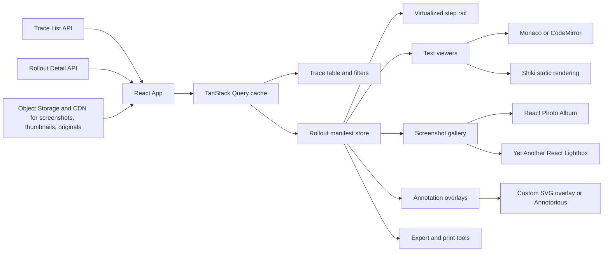
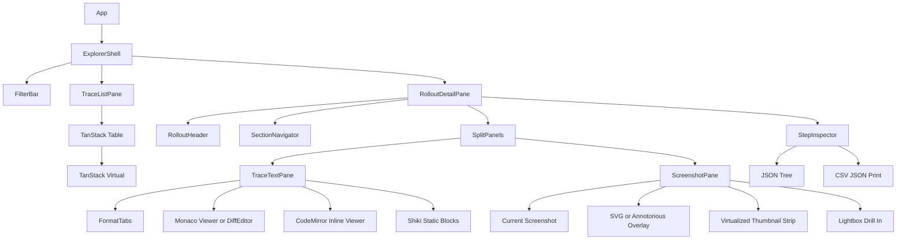

# Reusable Permissively Licensed TypeScript and React Components for an Agent Rollout Data Explorer

## Executive summary

For a web app that explores **large, per-level agent rollouts with step screenshots, AI-defined logical sections, multi-format text/code traces, and side-by-side comparisons**, the strongest baseline is **headless data and virtualization primitives plus specialized viewers**, not a monolithic “all-in-one” component library. The highest-confidence stack is:

- **TanStack Table + TanStack Virtual** for the rollout index, step rails, and any long lists.
- **Monaco** for the main text/code viewer and side-by-side diff mode.
- **CodeMirror 6** for lighter embedded viewers and smaller inline diffs.
- **Shiki** for static, high-fidelity syntax highlighting, especially when you pre-render or selectively load languages.
- **React Photo Album + Yet Another React Lightbox** for screenshot browsing, thumbnail strips, responsive images, zoom, fullscreen, and download.
- **Annotorious** for interactive screenshot overlays when annotations are geometric and reviewable; otherwise, use a **custom read-only SVG overlay** for maximum performance.
- **react-resizable-panels**, **react-scroll-sync**, **TanStack Query**, and **react-intersection-observer** as the shell utilities that make the explorer usable at scale. citeturn12view0turn12view1turn12view2turn13view0turn23view1turn13view2turn14view0turn14view1turn15search0turn36search0turn37search0turn38search0

The key architectural conclusion is that your **primary timeline/sequence viewer should be custom and virtualized**, built on TanStack Virtual, with **logical sections as first-class anchors**. Off-the-shelf timeline libraries such as **react-chrono** are useful for **summary lanes and section overviews**, but they are less suitable as the main rendering strategy for very long, media-heavy step streams because they impose their own card model and interaction model. TanStack Virtual is explicitly positioned for “massive lists, grids, and tables,” while react-chrono is positioned as an interactive, media-rich timeline component with search, slideshow, and rich cards. citeturn12view1turn16view0turn25search15

The best long-term UX is a **master-detail explorer** with a **searchable trace list**, a **virtualized step rail**, a **synchronized text/image detail pane**, and a **section navigator**. In that design, the single source of truth is not scroll position but **`selectedStepId` plus `selectedSectionId`**. That decision makes multi-format syncing, deep-linking, export, keyboard navigation, and screenshot prefetching much easier than trying to synchronize arbitrary panes by pixel offsets alone. This is especially important when one pane is code/diff text and the other is an image gallery or screenshot filmstrip.

## Recommended component stack

Bundle-size figures below are **approximate** and should be treated as decision aids rather than exact production cost. For composable libraries, real cost depends heavily on which subpackages, language packs, plugins, or workers you include.

| Name | Purpose | License | TypeScript support | React compatibility | Approx bundle signal | Key features | Integration notes and tradeoffs |
|---|---|---:|---|---|---|---|---|
| **TanStack Table** | Searchable, filterable rollout/trace list | MIT | Strong type-safe APIs | Official React adapter | Headless; exact gzip not prominent in retrieved primary docs | Sorting, filtering, grouping, aggregation, row selection; server-side friendly; designed to be virtualizable | Best base for the master rollout index because you keep full control over columns, filters, and row rendering. Pair it with TanStack Virtual for large result sets. Tradeoff: more assembly work than a turnkey grid. NPM signal is very large at roughly 15M weekly downloads. citeturn12view0turn30search0 |
| **TanStack Virtual** | Virtualized step rails, screenshot strips, large lists/grids | MIT | Hook-based, typed | React adapter | **10–15 KB** from official repo | Vertical, horizontal, and grid virtualization; dynamic/measured sizing; sticky items; 60 FPS target | This should be the backbone of the main step sequence UI. It is a much better fit than a premade timeline widget when rollouts get long or media-heavy. Tradeoff: it is headless, so you own more layout and accessibility wiring. NPM signal is also very large at roughly 13–15M weekly downloads. citeturn12view1turn30search1turn30search5 |
| **react-chrono** | Summary timeline for sections or condensed run overviews | MIT | Built with TypeScript | React **18.2+ / 19+** in current README | About **60.5 KB gzip** | Timeline modes, nested timelines, search, keyboard navigation, images/videos, custom content | Use this for a **summary/overview timeline**, not the primary thousands-of-steps viewer. It is feature-rich and accessible, but opinionated. Current repo docs are modernized and MIT licensed. citeturn16view0turn22search7 |
| **@monaco-editor/react** plus **monaco-editor** | Primary code/text viewer, folding, side-by-side diff | MIT | Strong TS via Monaco APIs; wrapper documents `useMonaco`, `Editor`, `DiffEditor` | React wrapper with hook support | `monaco-editor` is about **20.8 KB gzip** on Bundlephobia, but real shipped cost is often materially higher once workers/languages/assets are included | Diff editor, multi-model editing, validation, rich decorations, folding, IDE-like behavior | Best option when you want the explorer to feel like a serious code/log investigation tool. It is particularly strong for Claude/Codex outputs that contain code, patches, JSON, or mixed text. Tradeoff: worker/assets setup and real-world size are heavier than lighter editors. The wrapper remains widely used on npm, but the latest stable npm publish visible here is older than some of the other packages in this report, so verify current release cadence before locking in. citeturn13view0turn9search2turn7search20turn47search0 |
| **@uiw/react-codemirror** plus **react-codemirror-merge** | Embedded viewers, compact diffs, inline code panes | MIT | Written in TypeScript | React hooks, documented for React **16.8+** | Extension-dependent | CodeMirror 6, theme support, Markdown with code-language highlighting, merge viewer, hook APIs | This is the best “lighter than Monaco” option for inline or secondary panes. It is especially useful for collapsed section previews, metadata snippets, or embedded patch boxes inside cards. Tradeoff: you assemble more behavior via extensions, and the editor is less IDE-like than Monaco. NPM signal is extremely strong at roughly 2.9M weekly downloads. citeturn23view1turn23view2turn29search8 |
| **Shiki** | Static syntax highlighting for pre-rendered snippets | MIT | TS-first project | Framework-agnostic, easy to use in React pipelines | **`shiki/core` ~34 KB gzip**; full `shiki` can reach **~1.3 MB gzip** when shipping all languages/themes as async chunks | TextMate-grade highlighting, custom grammars/themes, accurate tokenization | Strongest choice for **static or SSR highlighting**, especially for custom “LLM transcript” renderers. Prefer `shiki/core` or selective loading, not the full client bundle. This is the library I would use for section previews, print/export, and static-readable snapshots. NPM signal is extremely large at roughly 16.6M weekly downloads. citeturn13view2turn41search0turn31search2 |
| **React Photo Album** | Screenshot grid, filmstrip, masonry/rows/columns | MIT | Built-in types | React **18+** | About **3.7 KB gzip** | Rows, columns, masonry; SSR support; responsive `srcset`/`sizes`; performance-minded | Excellent default gallery layer for step screenshots. It is especially good because it already thinks in responsive images and SSR. It is not a lightbox, so pair it with Yet Another React Lightbox. Tradeoff: for SSR you need `defaultContainerWidth` or a skeleton strategy to avoid empty markup or layout shift. NPM signal is about 88.9K weekly downloads. citeturn14view0turn24search23turn29search0turn28search3 |
| **Yet Another React Lightbox** | Zoom/lightbox/fullscreen/download for screenshots | MIT | Type definitions shipped | React component with plugin ecosystem | **Lite build ~5.5 KB gzip**; full plugin setup varies | Responsive images, thumbnails, zoom, video, fullscreen, download, inline carousel | Best companion to React Photo Album. It is unusually well-suited to your use case because it explicitly prefers multi-resolution responsive images and ships plugins for thumbnails, zoom, download, fullscreen, and video. Tradeoff: the richer plugin setup needs more CSS and slide metadata. NPM signal is about 354K weekly downloads. citeturn14view1turn22search12turn22search8turn32search0 |
| **Annotorious React** | Interactive screenshot overlays and reviewable annotations | BSD-3-Clause | TypeScript and React support | React bindings; OpenSeadragon/high-res path exists | Moderate; exact gzip not prominent in retrieved primary docs | Client-only image annotation, React support, W3C-aligned data model, high-resolution zoomable image support | Best fit when annotations are **first-class review objects** and not just passive highlights. Good for bounding boxes, polygons, or comments that may later be edited or audited. Tradeoff: current v3 docs/discussions indicate the React side is more headless than older toolchains and there is **no default popup editor** in the v3 path; plan to build your own review UI. NPM signal is about 9.5K weekly downloads. citeturn15search0turn22search10turn22search14turn22search22turn15search8turn29search3 |
| **react-image-annotate** | Annotation authoring workstation | MIT | React library; TS not strongly emphasized in retrieved source | React component | Heavier workstation-style component | Polygons, bounding boxes, points, image/video annotation | I would use this for **internal labeling or QA tooling**, not as the main user-facing screenshot viewer. It is much more like a full annotation app embedded inside your UI. Tradeoff: it brings a stronger opinion about layout and interaction, and users have reported limited control over the wrapper container. citeturn14view3turn22search2 |
| **react-resizable-panels** plus **react-scroll-sync** | Split-screen layout and synchronized panes | MIT | `react-resizable-panels` ships `.d.ts`; `react-scroll-sync` v1+ has built-in TS defs | React components and wrappers | Small-to-moderate shell utilities | Resizable panel groups/layouts; scroll-sync wrappers around scrollable panes | These are the right shell primitives for your side-by-side synchronized explorer. Use them around Monaco/CodeMirror and screenshot panes instead of inventing split layouts yourself. Tradeoff: use **step IDs and section anchors as the primary sync model**; raw scroll-sync should be a helper, not the source of truth. `react-resizable-panels` has a very large npm signal at roughly 30M weekly downloads. citeturn36search0turn36search2turn37search0turn45search1 |

### Supporting utilities worth adding around the core UI

For **data fetching and cache lifecycle**, **TanStack Query** is the most natural fit: it is explicitly built for fetching, caching, synchronizing, pagination/infinite scroll, prefetching, and background updates, and it is MIT licensed with very large npm usage. For **lazy loading visibility**, **react-intersection-observer** gives you a typed React wrapper around the browser Intersection Observer API. For **exports**, **Papa Parse**, **FileSaver.js**, and **react-to-print** cover CSV parsing/serialization, save-as downloads, and browser print flows under MIT licenses. For **accessibility primitives around your custom shell**, **React Aria** and **Radix Primitives** are both strong choices, with React Aria emphasizing tested accessibility and hooks/components, and Radix emphasizing MIT-licensed accessible primitives. citeturn12view2turn30search2turn38search0turn39search0turn44search0turn44search1turn19search1turn44search2turn19search2turn44search3turn12view3turn6search1

## Suggested architecture and integration plan

The cleanest design is to separate the explorer into **metadata, text artifacts, screenshots, and annotations**, and to keep the **manifest** as the canonical unit of fetch. The app should fetch a lightweight rollout manifest first, then progressively fetch heavier artifacts only when a user opens a rollout, selects a section, or approaches a step in the viewport. This matches TanStack Query’s strengths around prefetching and background caching, and it matches the responsive-image design encouraged by React Photo Album and Yet Another React Lightbox. citeturn12view2turn14view0turn14view1



### Recommended frontend composition

Use a **master-detail layout**. The left side is the searchable/filterable list of rollouts. The right side is a rollout detail view with a **section navigator**, **virtualized step list**, and **split viewer** for text plus screenshots. That split viewer should be wrapped in resizable panels, with optional scroll sync where it helps but with **selection state** as the real coordination mechanism. citeturn12view0turn12view1turn36search0turn37search0



### Canonical data shape

A rollout explorer becomes much easier to evolve if you normalize everything around **step IDs** and **section IDs**. The AI-produced logical sections should not be mere labels; they should be explicit entities that can own step ranges, summary text, annotations, and navigation anchors.

```ts
export type RolloutFormat =
  | "claude-code"
  | "codex"
  | "markdown"
  | "patch"
  | "json"
  | "plain";

export interface ScreenshotVariant {
  url: string;
  width: number;
  height: number;
  mimeType: "image/avif" | "image/webp" | "image/jpeg" | "image/png";
}

export interface ScreenshotAsset {
  stepId: string;
  sha256: string;
  original: ScreenshotVariant;
  thumb320?: ScreenshotVariant;
  thumb640?: ScreenshotVariant;
  blurDataURL?: string;
}

export interface TextArtifact {
  stepId: string;
  format: RolloutFormat;
  languageHint?: string; // "diff" | "json" | "markdown" | custom tokenizer key
  content: string;
}

export interface TextRangeAnnotation {
  startLine: number;
  endLine: number;
  kind: "section" | "warning" | "error" | "diff-focus" | "tool-output";
  label: string;
}

export interface ImageRegionAnnotation {
  x: number;      // normalized 0..1
  y: number;      // normalized 0..1
  width: number;  // normalized 0..1
  height: number; // normalized 0..1
  label: string;
}

export interface StepAnnotation {
  stepId: string;
  sectionId: string;
  summary?: string;
  textRanges?: TextRangeAnnotation[];
  imageRegions?: ImageRegionAnnotation[];
}

export interface RolloutStep {
  id: string;
  index: number;
  ts?: string;
  status?: "ok" | "warning" | "failed";
  artifacts: TextArtifact[];
  screenshots: ScreenshotAsset[];
}

export interface RolloutSection {
  id: string;
  label: string;
  startStepId: string;
  endStepId: string;
  summary?: string;
}

export interface RolloutManifest {
  rolloutId: string;
  levelId: string;
  model: string;
  formatFamily: string;
  sections: RolloutSection[];
  steps: RolloutStep[];
  annotations: StepAnnotation[];
}
```

### Storage, thumbnails, and caching

For screenshots, use **object storage plus CDN** and save images in a **content-addressable or immutable versioned path scheme**. The screenshot manifest should carry width, height, hash, and available derivatives. The frontend libraries in this report all benefit when image dimensions are known up front: React Photo Album uses dimensions to compute its layouts and `srcset`; Yet Another React Lightbox explicitly prefers multi-resolution slides; and PhotoSwipe-based viewers require predefined dimensions. citeturn14view0turn14view1turn22search1

A practical storage convention looks like this:

```txt
/levels/{levelId}/rollouts/{rolloutId}/steps/{stepIndex}/screens/{screenHash}/
  original.webp
  w640.webp
  w320.webp
  w160.webp
  meta.json
```

A good `meta.json` should include:

- width and height,
- sha256 or other immutable content hash,
- creation timestamp,
- optional blur placeholder,
- optional OCR or caption text if you later want screenshot text search,
- any precomputed AI regions or overlay anchors.

For caching, treat **metadata and binaries differently**. Use **TanStack Query** to cache rollout lists, manifests, section summaries, and small step payloads. For screenshots, rely first on **HTTP cache + CDN + immutable URLs**; then add **viewport-driven lazy loading** and **adjacent-step prefetching**. The browser is already good at caching images if your image URLs are immutable and your cache headers are correct. Use `react-intersection-observer` or native Intersection Observer to delay image decode until users are near the relevant step. citeturn12view2turn38search0turn46search13

A simple adjacent-step image prefetch strategy:

```ts
import { useEffect } from "react";

export function usePrefetchNeighborScreenshots(
  selectedIndex: number,
  steps: RolloutStep[],
  radius = 2,
) {
  useEffect(() => {
    const items = steps.slice(
      Math.max(0, selectedIndex - radius),
      Math.min(steps.length, selectedIndex + radius + 1),
    );

    for (const step of items) {
      for (const shot of step.screenshots) {
        const img = new Image();
        img.src = shot.thumb640?.url ?? shot.original.url;
      }
    }
  }, [selectedIndex, steps, radius]);
}
```

### Viewer routing and annotation rendering

Your app should not bind “format” directly to a single component. Instead, create a **viewer registry** so each artifact can choose the cheapest fitting renderer:

```ts
type ViewerKind = "monaco" | "codemirror" | "codemirror-merge" | "shiki";

interface ViewerSpec {
  kind: ViewerKind;
  language: string;
  staticPreferred?: boolean;
}

const registry: Record<RolloutFormat, ViewerSpec> = {
  "claude-code": { kind: "monaco", language: "markdown" },
  "codex": { kind: "monaco", language: "markdown" },
  patch: { kind: "codemirror-merge", language: "diff" },
  json: { kind: "codemirror", language: "json" },
  markdown: { kind: "codemirror", language: "markdown" },
  plain: { kind: "shiki", language: "text", staticPreferred: true },
};
```

For **text annotations**, prefer native editor decorations rather than DOM overlays. Monaco supports editor/diff APIs and decorations; CodeMirror supports extension-based decoration systems. That is a better fit for logical-section shading, warning glyphs, collapsible summaries, and line-range highlighting than trying to absolutely-position foreign elements over scrolling code. Monaco’s wrapper explicitly exposes `Editor`, `DiffEditor`, and `useMonaco`; UIW’s CodeMirror adapter exposes merge mode and hooks. citeturn13view0turn23view2

Example Monaco decorations for AI-defined sections:

```ts
import type * as monaco from "monaco-editor";

export function applySectionDecorations(
  editor: monaco.editor.IStandaloneCodeEditor,
  sections: Array<{ startLine: number; endLine: number; className: string }>
) {
  const decorations = sections.map((s) => ({
    range: new monaco.Range(s.startLine, 1, s.endLine, 1),
    options: {
      isWholeLine: true,
      linesDecorationsClassName: s.className,
      minimap: { color: "#666", position: 1 },
      overviewRuler: { color: "#666", position: 2 },
    },
  }));

  return editor.deltaDecorations([], decorations);
}
```

For **image annotations**, use **custom SVG overlays** when annotations are read-only and already computed by your AI pipeline. Use **Annotorious** only when annotations are interactive objects that users may inspect, create, or edit. That split keeps the hot path fast while still leaving room for a richer review mode later. Annotorious also gives you an upgrade path for zoomable or very large images through its OpenSeadragon support. citeturn22search10turn22search22

## UI patterns for annotated rollouts

### Pattern for the main explorer

The best main screen is a **three-tier information hierarchy**:

1. **Trace list** for “which rollout do I open?”
2. **Section rail** for “which logical chunk of the rollout do I jump to?”
3. **Step detail** for “what happened at this exact step?”

That hierarchy is more robust than a full-screen timeline because it supports keyboard navigation, deep-linking, fast search, and progressive disclosure. TanStack Table and TanStack Virtual handle the first two layers; Monaco/CodeMirror/Shiki and the screenshot stack handle the third. citeturn12view0turn12view1turn13view0turn23view1turn13view2turn14view0turn14view1

### Pattern for synchronized viewers

There are really **three different synchronization problems**, and each should use a different strategy.

For **text-text compare**—for example, Claude output vs. Codex output for the same step—use **Monaco DiffEditor** first and **CodeMirror Merge** second. Monaco is better when the content is code-like or line-oriented and when you want folding, gutter markers, navigation, or richer editor affordances. CodeMirror Merge is the right lightweight alternative for embedded diffs inside cards or inspectors. citeturn13view0turn23view2

For **text-image sync**, do **not** try to align by raw scroll position. Align by **`selectedStepId`**, with a thumbnail strip that follows the selected step and a screenshot pane that shows the current image. Scroll-sync can help when two panes are structurally similar, but it is not the correct primary model when one side is text and the other is media. The right toolchain is **react-resizable-panels** for the shell and **react-scroll-sync** for occasional linked scrolling between related text panes. citeturn36search0turn37search0

For **section-level sync**, render a compact virtualized section rail and let each section jump to the first step in scope. If you want a richer “overview-only” display of sections with titles, media, or nested structure, **react-chrono** is a credible summary component. If you later discover that rollouts branch—retries, backtracks, tool forks, or alternative agent paths—add an optional **graph mode** with **React Flow / `@xyflow/react`**, which is explicitly designed for customizable node-based UIs and has SSR support in its current generation. citeturn16view0turn16view2turn25search10turn31search0

### Pattern for annotation overlays

For **text traces**, annotate in the viewer itself:

- line-range shading for logical sections,
- glyph-margin icons for warnings/failures,
- code folding regions for long raw tool output,
- minimap or overview-ruler marks for dense runs,
- inline badges for agent/tool boundaries.

Monaco is strongest for this style of instrumentation; CodeMirror also supports it well through extensions. Shiki is best when you are rendering a static or printable version of the same artifact. citeturn13view0turn23view2turn41search0

For **screenshots**, prefer two tiers:

- a **read-only overlay mode** built with SVG or absolutely-positioned HTML for the main explorer;
- an **interactive review mode** built with Annotorious when you need clicking, editing, or annotation persistence.

`react-image-annotate` is better reserved for **authoring/admin workflows** because it behaves more like a complete annotation workstation than a passive overlay renderer. citeturn22search10turn22search22turn14view3

### Pattern for image drill-in and galleries

A very strong combination is:

- **React Photo Album** for the inline screenshot grid or filmstrip,
- **Yet Another React Lightbox** for zoom/fullscreen/thumbnails/download,
- **responsive image variants** in your manifest so the browser can choose the correct asset size.

This combination matches the preferred input model of both libraries and gives you a better performance profile than shipping only the original-resolution screenshots. React Photo Album explicitly supports responsive `srcset`/`sizes`, and Yet Another React Lightbox explicitly recommends multiple resolutions per slide and can auto-populate `srcset`/`sizes`. citeturn14view0turn14view1turn22search4

## Pitfalls and licensing caveats

The biggest technical pitfall is **underestimating bundle and runtime cost in the editor layer**. Monaco is a superb fit for investigation workflows, but the wrapper’s convenience should not trick you into thinking it is a tiny dependency. Bundlephobia’s package-level estimate for `monaco-editor` is modest, yet real application cost can increase substantially once workers, languages, and assets are fully shipped; one late-2025 issue report shows generated bundle artifacts above 6 MB in a specific build configuration. If you only need a compact inline viewer, CodeMirror is the safer default. citeturn9search2turn7search20turn13view0turn23view1

The second major pitfall is **shipping too much syntax-highlighting code to the client**. Shiki’s docs are very explicit that its full bundles can be large, while `shiki/core` is much smaller. For your explorer, that means Shiki should usually be a **static renderer, SSR path, or selective-loader path**, not the default live editor for every pane. citeturn41search0turn41search1

The media layer has its own footguns. **React Photo Album** needs dimensions and SSR strategy; without `defaultContainerWidth` or a skeleton, SSR can render empty markup or produce layout shift after hydration. **PhotoSwipe-style viewers** require predefined image dimensions and recommend avoiding very large images without special handling; its docs call out width/height requirements and say extremely large images are not the primary design target. That argues strongly for pre-generated responsive variants and explicit dimensions in your screenshot manifest. citeturn14view0turn22search1turn22search17

For annotations, be careful about picking an **authoring tool** when you really need a **viewer overlay**. Annotorious is a good fit if annotations are entities with persistence and interaction. By contrast, `react-image-annotate` is powerful for polygons, points, and labeling workflows, but it is more of an embedded workstation. There are also open reports about limited wrapper control in the React Image Annotate layout, which is another reason to keep it in admin/review tooling rather than the main production explorer. citeturn22search10turn22search22turn14view3turn22search2

There is also a real **supply-chain caveat** around TanStack packages in 2026. GitHub’s advisory states that on **May 11, 2026**, malicious versions were published across multiple `@tanstack/*` packages. If you adopt TanStack Table, Virtual, Query, or Router, pin versions carefully, verify lockfiles, and incorporate CI dependency scanning. This does **not** mean “don’t use TanStack”; it means “use it with disciplined package governance.” citeturn34search1turn34search3

On licensing, your requested license set is practical, but you still need to be **package-specific**. This report stays inside **MIT, Apache-2.0, and BSD-3-Clause** for the recommended main stack. If you later evaluate alternatives, note that some attractive ecosystem options have **community MIT tiers plus paid/commercial tiers**. Two common examples are **AG Grid** and **MUI X**: both offer MIT-licensed community packages, but they also maintain commercial/enterprise tiers. That is not necessarily a problem, but it means you should be careful about which package names enter your dependency tree and which features your implementation relies on. citeturn33search0turn33search3turn33search16turn33search2turn33search8

The final accessibility caveat is that **headless libraries give you power but remove excuses**. TanStack Table and Virtual are excellent, but they do not magically give you accessible focus management, roving tab index, keyboard shortcuts, or dialog/listbox behavior. For those pieces, use **React Aria** or **Radix** rather than hand-rolling menus, tabs, dialogs, toggles, and listboxes. React Aria’s docs explicitly emphasize tested accessibility and screen-reader support; Radix’s repo emphasizes accessible UI primitives under MIT. citeturn12view3turn6search1

## Source index and GitHub repository links

The citations below point to primary repos, docs, package pages, or license surfaces for the most relevant projects.

| Project | Source links |
|---|---|
| TanStack Table | Repo and README: citeturn12view0 · npm package stats: citeturn30search0 |
| TanStack Virtual | Repo and README: citeturn12view1 · npm package stats: citeturn30search1 |
| TanStack Query | Repo and README: citeturn12view2 · npm package stats: citeturn30search2 |
| Monaco React | Repo and README: citeturn13view0 · npm package stats: citeturn47search0 |
| Monaco Editor | Bundlephobia size surface: citeturn9search2 |
| UIW React CodeMirror | Repo and README: citeturn23view1turn23view2 · npm package stats: citeturn29search8 |
| Shiki | Repo and README: citeturn13view2 · docs and bundle-size guidance: citeturn41search0turn41search1 · npm stats: citeturn31search2 |
| React Photo Album | Repo and README: citeturn14view0 · docs: citeturn24search5 · npm stats: citeturn29search0turn28search3 |
| Yet Another React Lightbox | Repo and README: citeturn14view1 · docs/plugins: citeturn22search4turn22search12 · npm stats: citeturn32search0 |
| Annotorious React | Repo/license surface: citeturn15search0 · docs: citeturn22search10turn22search14turn22search22 · npm stats: citeturn29search3turn47search1 |
| React Image Annotate | Repo and README: citeturn14view3 |
| react-resizable-panels | Repo and README: citeturn36search0turn36search2 · npm stats: citeturn36search1turn45search1 |
| react-scroll-sync | Repo and README: citeturn37search0 |
| react-intersection-observer | Repo and README: citeturn38search0turn38search2 · npm stats: citeturn39search0turn45search2 |
| react-chrono | Repo and README: citeturn16view0 · npm package surface: citeturn28search1 · bundle signal: citeturn22search7 |
| React Flow / `@xyflow/react` | Repo and README: citeturn16view2 · docs/blog: citeturn25search10turn24search15 · npm stats: citeturn31search0 |
| React Aria | Repo and docs surface: citeturn12view3 · npm stats: citeturn30search3turn17search1 |
| Radix Primitives | Repo and license surface: citeturn6search1 |
| Papa Parse | Repo/readme: citeturn44search0 · npm stats: citeturn44search1 |
| FileSaver.js | Repo/readme and license: citeturn19search1turn19search7 · npm stats: citeturn44search2 |
| react-to-print | Repo and README: citeturn19search2turn19search5 · npm stats: citeturn44search3 |
| AG Grid licensing reference | Repo/license surfaces: citeturn33search0turn33search3turn33search16 |
| MUI X licensing reference | Repo/license discussion surfaces: citeturn33search2turn33search8 |